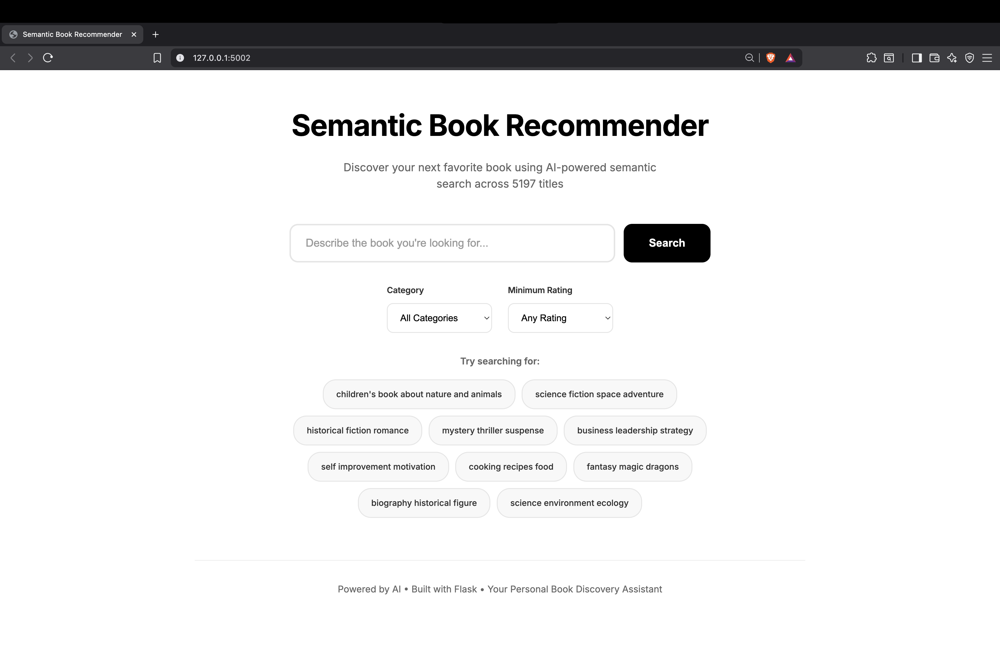
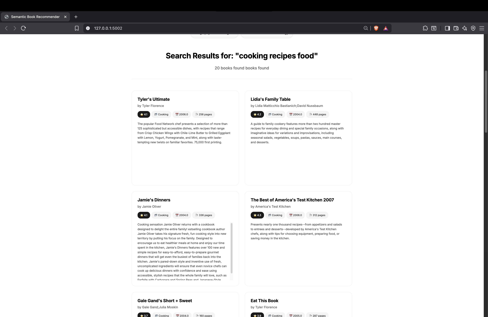
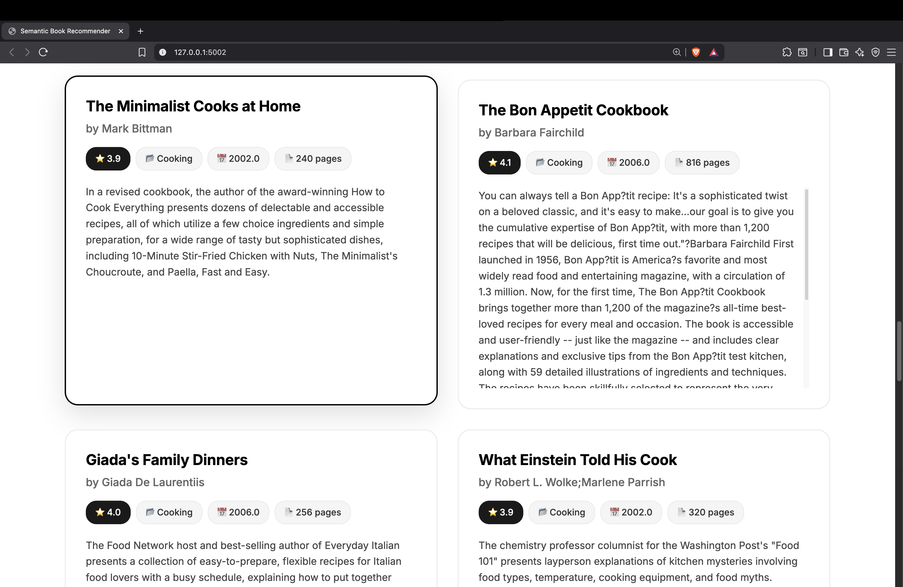

# Book Recommender System
<div align="center">


[](https://github.com/Manojgowda898/semantic_book_recommender/commits/main)

</div>
A sophisticated book recommendation system built with Flask and machine learning, featuring content-based filtering and vector similarity search for intelligent book suggestions.

---

## 🚀 Features
### Core Functionality
- ✅ Intelligent book recommendations based on content similarity
- ✅ Vector-based similarity search using FAISS
- ✅ Book search and filtering capabilities
- ✅ Clean web interface with responsive design
- ✅ Real-time recommendation generation
- ✅ Book details and metadata display

### Machine Learning & Data Processing
- **Content-Based Filtering**: Recommends books similar to user preferences
- **Text Vectorization**: Converts book descriptions to numerical vectors
- **Similarity Search**: FAISS for efficient nearest neighbor search
- **Data Cleaning**: Comprehensive preprocessing of book metadata
- **Feature Engineering**: Combines title, author, and description features

---

## 🛠️ Tech Stack

### Backend & AI
- **Framework**: Flask
- **Language**: Python 3.8+
- **Vector Database**: ChromaDB
- **Embeddings**: Sentence Transformers (all-MiniLM-L6-v2)
- **Data Processing**: Pandas, NumPy
- **ML Libraries**: scikit-learn, LangChain

### Frontend
- **HTML5**: Semantic markup
- **CSS3**: Modern styling with Flexbox/Grid
- **JavaScript**: Interactive features
- **Responsive Design**: Mobile-first approach

### Development Tools
- **Jupyter Notebook**: Data analysis and cleaning
- **Virtual Environment**: Python isolation
- **Git**: Version control

---

## 📁 Project Structure

```
book_recommender/
├── app.py                      # Main Flask application
├── create_database.py          # Database and vector index creation
├── requirements.txt            # Python dependencies
├── test_database.py           # Database testing script
├── test_imports.py            # Dependency testing
├── books_cleaned.csv          # Processed book dataset
├── book_vector_db/            # FAISS vector database
├── book_vector_db_enhanced/   # Enhanced vector indices
├── data/                      # Raw data files
├── notebook/
│   └── data_cleaning.ipynb    # Data preprocessing notebook
├── static/
│   ├── style.css              # Stylesheet
│   └── script.js              # Frontend JavaScript
└── templates/
    └── index.html             # Main web interface
```
---

## 🛠️ Installation & Setup
### Prerequisites
- Python 3.8 or higher
- pip (Python package manager)
- Virtual environment

### Installation Steps
```bash
# Clone the repository
git clone <repository-url>
cd book_recommender

# Create virtual environment
python -m venv .venv

# Activate virtual environment
# On macOS/Linux:
source .venv/bin/activate
# On Windows:
# .venv\Scripts\activate

# Install dependencies
pip install -r requirements.txt
```

---

## 🔧 Database Setup & Testing
### Step 1: Test Dependencies
Before creating the database, verify all dependencies are installed correctly:
```bash
# Run the import test script
python test_imports.py
```

Expected Output:
```
✅ Web framework
✅ AI/ML packages
✅ Database & LangChain packages

🎉 ALL PACKAGES IMPORT SUCCESSFUL!
NumPy: 2.3.3
Pandas: 2.3.3
Flask: 3.1.2
PyTorch: 2.8.0
```

### Step 2: Create the Vector Database
Build the FAISS vector database and process book data:
```bash
# Create the vector database and indices
python create_database.py
```

What this script does:
- Loads and processes books_cleaned.csv
- Creates text embeddings using TF-IDF or similar vectorization
- Builds FAISS indices for efficient similarity search
- Saves vector databases to book_vector_db/ and book_vector_db_enhanced/
- Generates necessary metadata files

Expected Output:
```
🔄 Creating enhanced vector database...
✅ Loaded 5197 books from CSV
📚 Created 5197 documents with complete metadata
✅ Enhanced vector database created at ./book_vector_db_enhanced/
```

### Step 3: Test the Database
Verify the database was created correctly:
```bash
# Test the database functionality
python test_database.py
```

Expected Output:
```
✅ Database works! Found 3 results
1. Baby Einstein: Neighborhood Animals
   Author: Marilyn Singer;Julie Aigner-Clark
   Rating: 3.89

2. Baby Einstein: Neighborhood Animals
   Author: Marilyn Singer;Julie Aigner-Clark
   Rating: 3.89

3. Prodigal Summer
   Author: Barbara Kingsolver
   Rating: 4.0

```

### Step 4: Start the Application
Once the database is set up, start the Flask application:
```bash
# Start the Flask server
python app.py
```

Expected Output:
```
* Serving Flask app 'app'
* Debug mode: off
* Running on http://127.0.0.1:5002
Press CTRL+C to quit
```

Access the application at: http://localhost:5002

---

## 📸 Screenshots & Demo
<div align="center">

### 🏠 Main Dashboard

Main interface showing search functionality and suggestions.

### 🔍 Search & Recommendations

Real-time search results and book recommendations

### 📚 Book Details

Detailed book information with similar recommendations

### 📱 Mobile Responsive

Fully responsive design for mobile devices

### 🎥 Live Demo

Live demonstration of the recommendation system

</div>

---

## 📚 Usage
### Using the Book Recommender
1. **Browse Books**: View the available book collection on the main page
2. **Search**: Use the search bar to find specific books by title or author
3. **Get Recommendations**: Click on any book to get similar recommendations
4. **Explore Details**: View detailed information about each book including descriptions and metadata

## API Endpoints
- GET / - Main application interface
- POST /recommend - Get book recommendations
- GET /search - Search books by query
- GET /book/<book_id> - Get specific book details

---

## 🔍 Machine Learning Pipeline
### Data Preprocessing
- **Data Cleaning**: Handling missing values, text normalization in data_cleaning.ipynb
- **Feature Extraction**: Combining title, author, and description features
- **Text Vectorization**: Converting text to numerical vectors using TF-IDF or similar methods
- **Dimensionality Reduction**: Optional PCA for feature optimization

### Recommendation Algorithm
- **Content-Based Filtering**: Uses book metadata and descriptions
- **Cosine Similarity**: Measures similarity between book vectors
- **FAISS Search**: Efficient nearest neighbor search for real-time recommendations
- **Hybrid Features**: Combines multiple book attributes for better recommendations

---

## 📊 Performance
- **Recommendation Speed**: Sub-second response time using FAISS
- **Search Efficiency**: O(log n) similarity search complexity
- **Scalability**: Supports thousands of books with efficient indexing
- **Memory Usage**: Optimized vector storage and retrieval

---

## 📜 License
This project is licensed under the **MIT License** – see the [LICENSE](LICENSE) file for details.

---

## 🤝 Contributing
Contributions are welcome! Please read our [Contributing Guidelines](CONTRIBUTING.md) before submitting issues or pull requests.

---

## 🙏 Acknowledgments
- FAISS team for efficient similarity search
- Scikit-learn for machine learning utilities
- Flask community for web framework
- Pandas for data manipulation capabilities

---
